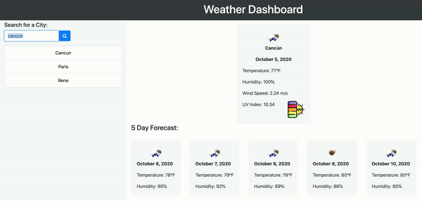

# Weather Dashboard
Created by [BMcCorm](https://github.com/BMcCorm) 

## Table of Contents
- [Description](#Description)
- [Installation](#Installation)
- [Usage](#Usage)
- [Contributing](#Contributors)
- [Testing](#Testing)
- [License](#License)
- [Questions](#Questions)

## Description
This weather app displays a five day forecast, along with the wind speed and UV index for the current day. Data is pulled from the OpenWeather API and uses localStorage to retain past inquiries. 

## Installation
This app doesn't require installation. Click [here](https://bmccorm.github.io/weather-dashboard/ ) to try for yourself.

## Usage
Enter a city name and hit the search icon. Previous searches will be displayed below. Click on a previous search to view the forecast again.    

## Interested in contributing? Here's how:

1. Fork this repository
2. Create a branch: git checkout -b "create_a_branch_name"
3. Make and commit your changes: git commit -m "add your message here"
4. Push to the master branch: git push origin "branch_name"
5. Create the pull request

Additional information on creating a pull request can be found [here](https://help.github.com/en/github/collaborating-with-issues-and-pull-requests/creating-a-pull-request). 

## Contributors
None at this time.

## Testing
None at this time.

## License
None at this time.

## Questions
For more information, please email me at BrielleMcCormick@gmail.com
The link for this project can be found [here.](https://BMcCorm.github.io/weather-dashboard/)

